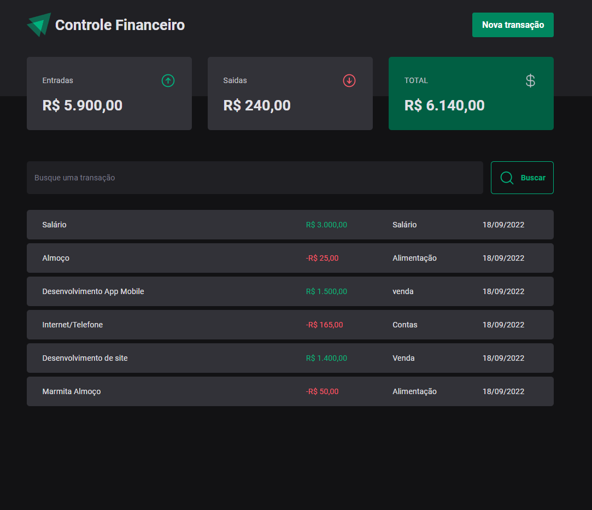

<div align="center">  
           
</div>
    
<p align="center">   
    
</p>
<p align="center">
  <a href="#about">About</a>&nbsp;&nbsp;&nbsp;|&nbsp;&nbsp;&nbsp;
  <a href="#technologies">Technologies</a>&nbsp;&nbsp;&nbsp;|&nbsp;&nbsp;&nbsp;
  <a href="#how-to-run">How to Run</a>&nbsp;&nbsp;&nbsp;|&nbsp;&nbsp;&nbsp; 
</p>

## About

DT Money is a personal finance management application. 

**If you liked this project initiative help me to continue with the project, just open an issuues saying that you are willing to collaborate with the project.**

## Technologies

### Frontend web
- [Typescript](https://www.typescriptlang.org/)
- [Vite](https://vitejs.dev/)
- [Styled Components](https://styled-components.com/)
- [React](https://reactjs.org/)
- [zod](https://zod.dev/)
- [json-server](https://www.npmjs.com/package/json-server)

## How to Run

- ### **Requirements**

  - It is **necessary** to have **[Node.js](https://nodejs.org/en/)** installed on your computer
  - It is **necessary** to have **[Git](https://git-scm.com/)** installed and configured on the computer
  - Also, you **must** have a package manager either **[NPM](https://www.npmjs.com/)** or **[Yarn](https://yarnpkg.com/ )**.   

1. Clone the repository:

```sh
  $ git remote add origin git@github.com:aleksanderpalamar/DTmoney.git
```

2. Running the Application:

```sh
  # Install the dependencies
  $ yarn install or npm install

  # Start the application
  $ yarn dev or npm run dev
```
---
<sup>Project developed by[Aleksander Palamar](https://github.com/aleksanderpalamar), [Portfolio](https://www.palamarsolutionit.com.br/).</sup>
